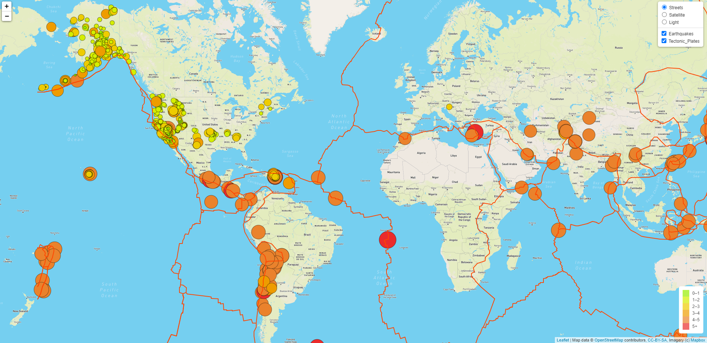
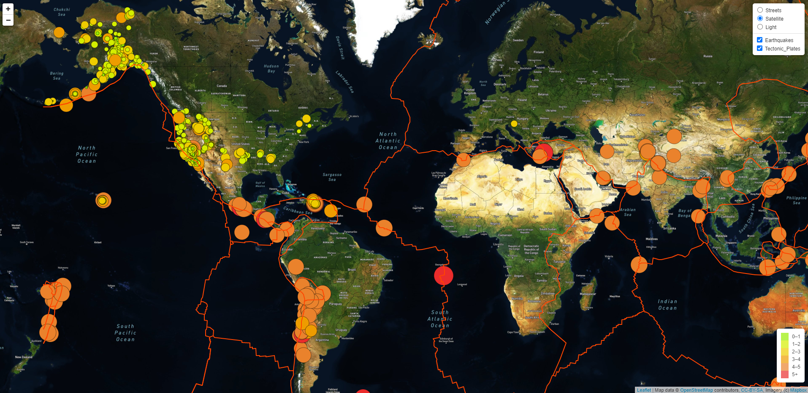
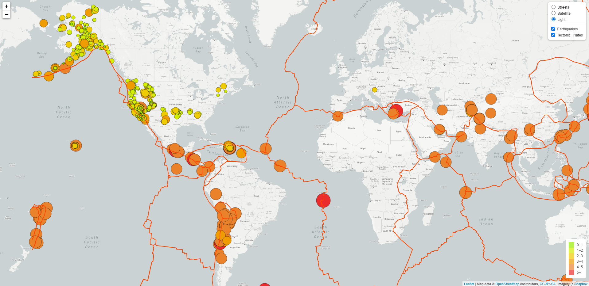

# Mapping Earthquakes

## Project Overview

- In this project, mapping of all the recorded earthquakes in the past seven days has been carried out.

## Summary 

- The data of the earthquakes has been taken from: 
  	https://earthquake.usgs.gov/earthquakes/feed/v1.0/summary/all_week.geojson
- Along with the earthquakes data, tectonic plates data has also been added to the map to illustrate the 
  relationship between the location and frequency of seismic activity and tectonic plates.

- The data of the tectonic plates has been taken from:	
	https://raw.githubusercontent.com/fraxen/tectonicplates/master/GeoJSON/PB2002_boundaries.json

- The map can be viewed in three map styles i.e. streets, satellite and light; to allow the users to view the map of 
  their choice. 
- Streets view

- Satellite view

- Light view

- The earthquakes layer and tectonic plates layer can be switched "ON" and "OFF" as per the users requirement.